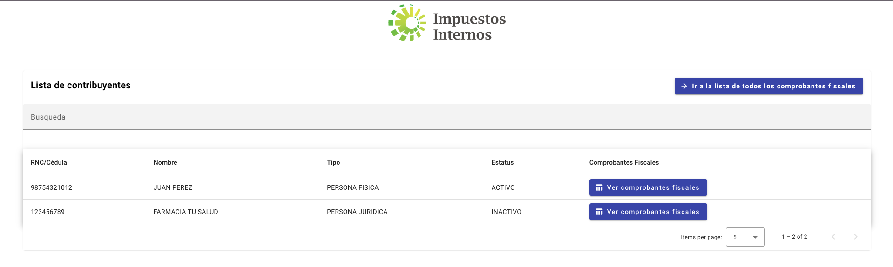
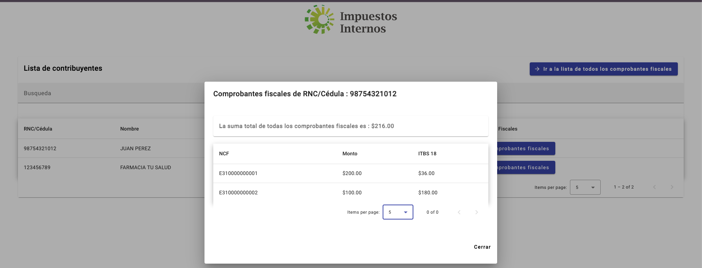

# DGII Assesment FrontEnd

This project was generated with [Angular CLI](https://github.com/angular/angular-cli) version 17.0.3.

The purpose of this project is to view a list of Taxpayers and their Tax Receipts, with the possibility of seeing the total amount of all ITBIS 18 of all tax receipts for each taxpayer.

## Project Structure and libraries

This project is divided in 8 Principal Folders:

    models: here are the interfaces for Taxpayers and Tax Receipts
    services : Here is the principal service with the only responsability to connect to the backend api
    shared : Here are the Layout of the application, the Angular Material Module and the resuable component Search Input
    state : Here is the state management of the application, using [NGXS](https://www.ngxs.io/)
    Taxpayer: Here are all the components for the page Taxpayer and the service to dispatch the store actions
    TaxReceipt : Here are all the components for the page Tax Receipts and the service to dispatch the store actions
    testing : Here are mock data in order to perform unit tests.

### Test Coverage

Currently this project has this Coverage Summary

## Application Images

Here are some images of the Application:

1 - Principal page : Taxpayers list

2 - Tax Receipts Dialog by Taxpayer Identification

3- The list of all Tax receipts stored on the database

## Development server

Run `ng serve` for a dev server. Navigate to `http://localhost:4200/`. The application will automatically reload if you change any of the source files.

## Build

Run `ng build` to build the project. The build artifacts will be stored in the `dist/` directory.

## Running unit tests

Run `ng test` to execute the unit tests via [Karma](https://karma-runner.github.io).
